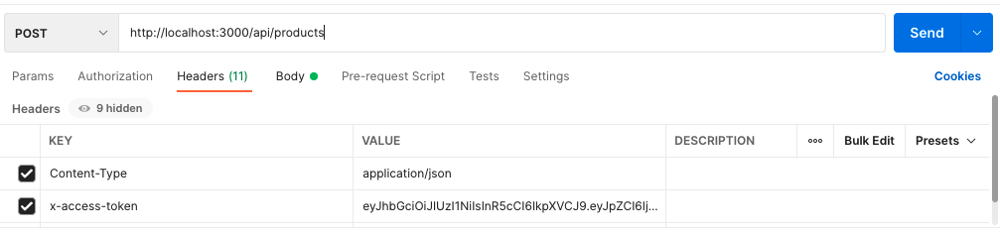

# APIRest with Nodejs, Express and mongoDB

En este ejemplo vamos a crear una api-rest para un crud de productos con autenticacion usando NODEJS, EXPRESS Y como base de datos MongoDB

## Empezando

Como "prerrequisito" necesito tener [NodeJS](https://nodejs.org) y [Yarn](https://classic.yarnpkg.com/lang/en/docs/install) instalados.

### 1. Descargar ejemplo e instalar dependencias

Descarga este ejemplo:

```
curl -L -o api-edge.tar.gz https://github.com/Carlos199/api-edge/archive/refs/heads/master.zip
```

Instalar dependencias de yarn:

```
cd api-edge
yarn install
```

<details><summary><strong>Alternativa:</strong> Clonar todo el repositorio</summary>

Clona este repositorio:

```
git clone https://github.com/Carlos199/api-edge.git
```

Instalar dependencias de yarn:

```
cd api-edge
yarn install
```

</details>

### 2. Inicie el servidor de la API REST

```
yarn dev
```

El servidor ahora se está ejecutando en `http://localhost:3000`. Puede enviar las solicitudes de API implementadas en `app.js`.

### 3. Prueba de rutas con postman

Para las rutas protegidas como POST, PUT, y DELETE se necesita envia en el `Headers` el `x-access-token` para obtener los permisos. Como se muestra abajo



## Documentación

La documentación está disponible en la carpeta `src/resources`, que contiene los archivos para postman y swagger.
Para poder ver la documentación en swagger se debe levantar el servidor local `yarn dev` y abrir la dirección http://localhost:3000/api-docs
